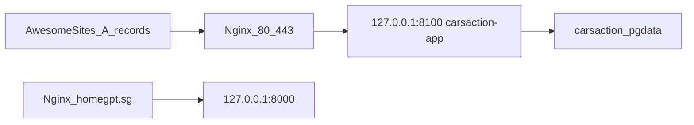

# Production deploy: carsaction.sg on Hostinger (beside HomeGPT)

## Constraints (locked)

- **Do not touch** `/opt/homegpt`, `mummies-buddy`, or their nginx site files.
- App path: `/opt/carsaction` from [https://github.com/iahmadraza7/carsaction](https://github.com/iahmadraza7/carsaction)
- Domain: **carsaction.sg** (Awesome Sites DNS) → VPS **187.77.148.141**
- Host bind: **`127.0.0.1:8100`** only (nginx is the public entry). Next.js listens on **3000 inside the container**, so compose maps `127.0.0.1:8100:3000` (same idea as HomeGPT’s 8000 pattern; 8000 stays HomeGPT’s).
- Compose project: `-p carsaction`, containers `carsaction-*`, volumes `carsaction_*`
- Own Postgres in Docker (never share HomeGPT data)
- Env file on VPS: `/opt/carsaction/.env` (not HomeGPT’s env)
- Nginx config is **HTTP-only first** + ACME challenge; Certbot adds SSL after DNS works
- Default Stripe mode for first go-live smoke: **test keys** in `.env`, then swap to live when client confirms

## 0. Local (Windows) before deploy

```powershell
cd D:\fiverr\carsaction
npm run lint
npx tsc --noEmit
npm run build

# Commit + push all M1 work to GitHub
git status
git add -A
git commit -m "Milestone 1: production-ready UI, SG filters, Docker deploy for Hostinger"
git push origin main
```

Repo: [https://github.com/iahmadraza7/carsaction](https://github.com/iahmadraza7/carsaction)

## 1. Repo file updates (implementation)

Align existing prod files with your coexistence rules:

| File | Change |
|------|--------|
| [`docker-compose.prod.yml`](docker-compose.prod.yml) → keep as prod compose (or alias) | `ports: ["127.0.0.1:8100:3000"]`, `PORT=3000`, named volumes already `carsaction_*`, project via `-p carsaction` |
| New [`deploy/nginx_carsaction.conf`](deploy/nginx_carsaction.conf) | HTTP-only `server_name carsaction.sg www.carsaction.sg`; `proxy_pass http://127.0.0.1:8100`; headers; `location ^~ /.well-known/acme-challenge/`; **no** `ssl_certificate` lines |
| Update [`docs/DEPLOY.md`](docs/DEPLOY.md) | Full runbook: DNS → clone → `.env` → compose → nginx → certbot → Stripe webhook → rollback (remove nginx symlink only) |
| [`deploy/deploy.sh`](deploy/deploy.sh) | Use port 8100 health check; `docker compose -p carsaction -f docker-compose.prod.yml` |

Env on VPS uses `.env` (copy from [`.env.production.example`](.env.production.example)): `AUTH_URL` / `NEXT_PUBLIC_APP_URL=https://carsaction.sg`, strong `POSTGRES_PASSWORD` + `AUTH_SECRET`, Stripe + Resend.

## 2. DNS on Awesome Sites (do this before Certbot)

In [Awesome Sites domains](https://awesomesites.org/customer/clientarea.php?action=domains) → **carsaction.sg** → DNS zone:

| Type | Host | Value | TTL |
|------|------|-------|-----|
| A | `@` | `187.77.148.141` | 300 |
| A | `www` | `187.77.148.141` | 300 |

**Why HomeGPT felt slow:** Certbot fails until DNS resolves worldwide. Wait until these succeed from your PC:

```powershell
nslookup carsaction.sg
nslookup www.carsaction.sg
# both must return 187.77.148.141
```

Do **not** run Certbot until that matches. Awesome Sites “No SSL” is fine; SSL is issued on the VPS.

## 3. VPS commands (SSH as root)

```bash
ssh root@187.77.148.141
```

### 3a. Packages (skip if already installed from HomeGPT)

```bash
apt update
apt install -y git nginx certbot python3-certbot-nginx
# Docker should already exist (homegpt). Confirm:
docker --version && docker compose version
```

### 3b. Clone + env

```bash
mkdir -p /opt/carsaction
cd /opt/carsaction
git clone https://github.com/iahmadraza7/carsaction.git .
cp .env.production.example .env
nano .env   # fill secrets (see checklist below)

# Generate secrets if needed:
openssl rand -base64 32   # AUTH_SECRET
openssl rand -base64 24   # POSTGRES_PASSWORD
```

Required in `/opt/carsaction/.env`:

```
POSTGRES_USER=carsaction
POSTGRES_PASSWORD=<strong>
POSTGRES_DB=carsaction
DATABASE_URL=postgresql://carsaction:<same>@db:5432/carsaction?schema=public
AUTH_SECRET=<strong>
AUTH_URL=https://carsaction.sg
AUTH_TRUST_HOST=true
NEXT_PUBLIC_APP_URL=https://carsaction.sg
STRIPE_SECRET_KEY=sk_test_...   # or sk_live_... later
STRIPE_WEBHOOK_SECRET=whsec_... # after Stripe Dashboard webhook
STRIPE_PRICE_GOLD=price_...
STRIPE_PRICE_PLATINUM=price_...
RESEND_API_KEY=                 # optional at first
```

### 3c. Build and start (isolated project)

```bash
cd /opt/carsaction
docker compose -p carsaction -f docker-compose.prod.yml --env-file .env up -d --build

# Health (localhost only)
curl -fsS http://127.0.0.1:8100/robots.txt

# Confirm HomeGPT untouched
docker ps --format '{{.Names}}\t{{.Ports}}' | grep -E 'homegpt|carsaction'
# Expect homegpt still on :8000, carsaction-app on 127.0.0.1:8100
```

Migrations run inside the app container on start (`prisma migrate deploy`). Admin/seed scripts (if needed once):

```bash
docker compose -p carsaction -f docker-compose.prod.yml exec app sh -c 'npx --yes tsx prisma/seed.ts'
# Only on empty DB; password Password123! — change admin after seed
```

### 3d. Nginx (HTTP only) — does not touch HomeGPT sites

```bash
cp /opt/carsaction/deploy/nginx_carsaction.conf /etc/nginx/sites-available/carsaction
ln -sf /etc/nginx/sites-available/carsaction /etc/nginx/sites-enabled/carsaction
nginx -t && systemctl reload nginx
```

### 3e. SSL (only after DNS points here)

```bash
certbot --nginx -d carsaction.sg -d www.carsaction.sg
# then:
curl -I https://carsaction.sg
```

### 3f. Stripe webhook (production URL)

Stripe Dashboard → Webhooks → `https://carsaction.sg/api/stripe/webhook`  
Events: `checkout.session.completed`, `customer.subscription.*`, `invoice.payment_succeeded`, `invoice.payment_failed`  
Paste `whsec_...` into `/opt/carsaction/.env`, then:

```bash
cd /opt/carsaction
docker compose -p carsaction -f docker-compose.prod.yml --env-file .env up -d --build app
```

### 3g. Firewall

```bash
ufw status
# Ensure OpenSSH + Nginx Full allowed (HomeGPT already needs this)
ufw allow OpenSSH
ufw allow 'Nginx Full'
ufw --force enable
```

## 4. Rollback (if nginx/HomeGPT worries)

```bash
rm -f /etc/nginx/sites-enabled/carsaction
nginx -t && systemctl reload nginx
# Optional stop stack only (does not touch HomeGPT):
cd /opt/carsaction && docker compose -p carsaction -f docker-compose.prod.yml down
```

HomeGPT stays up as long as you never edit its site file or stop its compose project.

## 5. Verification checklist

- [ ] `nslookup carsaction.sg` → `187.77.148.141`
- [ ] `https://carsaction.sg` loads (valid cert)
- [ ] `https://homegpt.sg` still works
- [ ] Browse `/cars`, open a listing
- [ ] Dealer subscribe (Stripe test card) → webhook → ACTIVE
- [ ] Admin login works

## 6. Redeploy later

```bash
cd /opt/carsaction
git pull origin main
docker compose -p carsaction -f docker-compose.prod.yml --env-file .env up -d --build
```



## Operator order (shortest path)

1. Push code to GitHub (local)  
2. Set DNS A records; wait for `nslookup`  
3. SSH → clone `/opt/carsaction` → `.env` → compose up  
4. Nginx HTTP → Certbot  
5. Stripe live/test webhook → smoke test  
6. Never open `8100` on UFW to the world  
